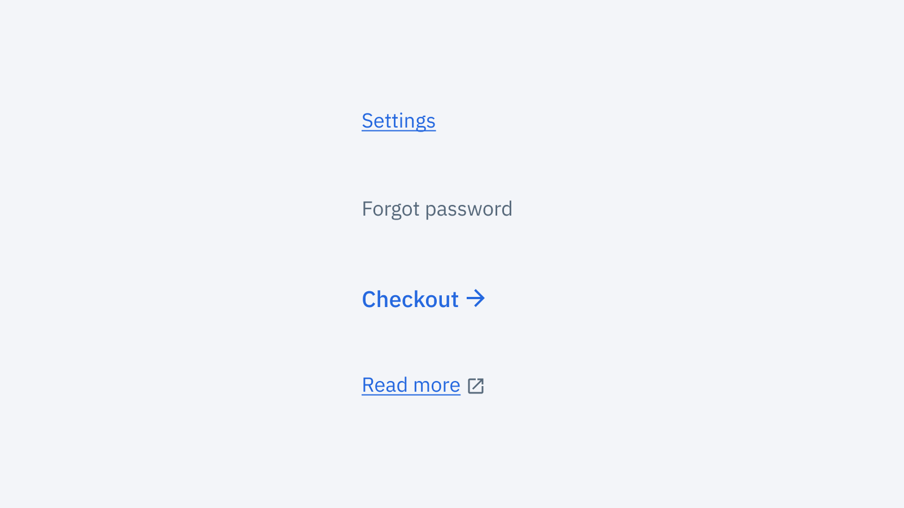
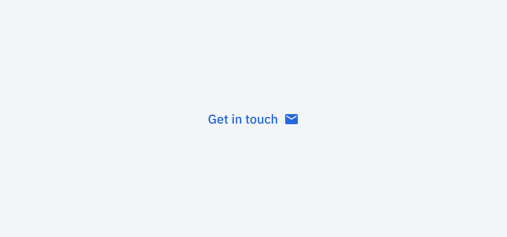
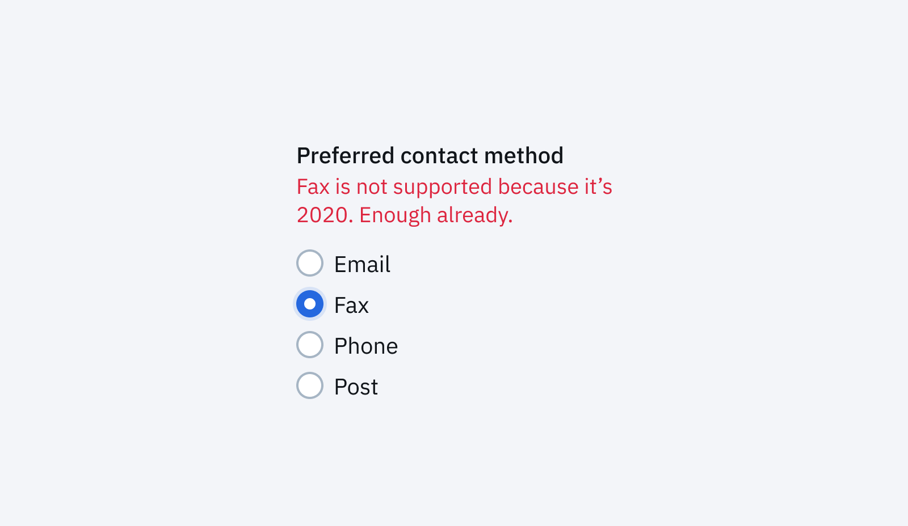

[[company-echo]]
| I originally wrote this post for [Echo's Engineering Blog](https://building.echo.co.uk/). Go check it out, it's a lovely team doing really cool stuff.

Almost every team I’ve been on in my career to date has, at some point, sat down and tried to agree on how and when to use Redux, GraphQL, CSS-in-JS or some other technology _du jour_. What far fewer teams have done is try to have a genuine conversation about the rules, constraints, and properties of their UI components. In other words, discussing the so called _API_ of their components.

This post tries to summarise some of the high-level considerations when building UI components to help have that conversation. Although all code examples will be in React, the gist of things should hopefully be transferable to whatever stack you may be using.

## The humble link

To have a foundation on which to discuss some high-level principles let’s consider the four versions of a link below:

<figure class="large">
  
</figure>

In this design we have:

- Normal links within apps that take you from page A to page B
- Visually subtle links that are rarely used and shouldn’t draw your focus too much
- Prominent links that are the main CTA where we’d like an extra arrow icon to make them stand out as important
- External links that will open in a new tab and take you somewhere outside of the app you are currently in

If you consider the above design of a link, there are hundreds of subtly different component APIs that you could consider. However, we have to start somewhere so let’s start by considering what you would do in plain HTML:

```jsx
// Normal links:
<a href="/settings">Settings</a>

// Subtle links
<a href="/password-reset" class="subtle">Forgot password</a>

// Icon links:
<a href="/checkout">Checkout <svg>...</svg></a>

// External links:
<a href="http://echo.co.uk/legal" target="_blank">T&Cs <svg>...</svg></a>
```

Converting the links and icons above into individual React components **could** look something like this:

```jsx
// Normal links:
<Link href="/settings">Settings</Link>

// Subtle links
<Link href="/password-reset" variant="subtle">Forgot password</Link>

// Icon links:
<Link href="/checkout">Checkout <ArrowIcon /></Link>

// External links:
<Link href="http://echo.co.uk/legal" target="_blank">
	T&Cs <NewWindowIcon />
</Link>
```

So that’s it right? What else is there to discuss?

### The devil in the details

The above API is not without problems.

Firstly, how does one set the spacing between the icon and the text? You could blanket apply some sort of spacing between icons within links? Something like this:

```css
.link-component .icon {
  margin-left: 8px;
}
```

This technically works but it does leave you with some icon specific styles in your link component (or the other way around) which will be brittle.

It’s also unclear how you would handle the two different icon sizes between icon and external links? Maybe a size prop on the Icon components?

```jsx
// Icon links:
<Link href="/checkout">Checkout <ArrowIcon size="large" /></Link>

// External links:
<Link href="http://echo.co.uk/legal" target="_blank">
	T&Cs <NewWindowIcon size="small" />
</Link>
```

Hover states as well could be a bit of a headache. On external links we want the icon to be a different colour than the text, while on the icon link we want them to match. Here, as well, we could add some more custom CSS targeting a specific icon. Once again this feels brittle, just like with margins.

Really though, the main challenge of the above API is the flexibility it offers. Nothing is stopping you from ending up with all sorts of strange patterns. For example:

- A subtle-link with an icon 👎
- An external link which opens in the same window (if you forget to add `target="_blank"`) 👎
- An external link with a different icon 👎
- A link with a leading icon 👎

### Lets fix all the problems (maybe)

To fix some of these problems let’s try a different approach.

You could build a component with the following API:

```jsx
// Normal links:
<Link href="/settings">Settings</Link>

// Subtle links:
<Link href="/password-reset" variant="subtle">Forgot password</Link>

// Icon links:
<Link href="/checkout" variant="cta">Checkout</Link>

// External links:
<Link href="http://echo.co.uk/legal" variant="external">T&Cs</Link>
```

In this alternate API each `variant` sets the right behaviour, icon, spacing and typography.

This feels clearly better than our first attempt. It does a much better job at encapsulating the behaviour and styles we want. We have ‘baked in’ design decisions into our link component so each time you go to use it you don’t have to remember the specifics for each one.

We have, however, introduced other issues.

You can still “use it wrong” by linking to an external page with the `variant="cta"` because you want it to stand out.

Also, when looking at a design, it’s a bit of a leap to know the right props/components to use. Imagine you didn’t build this component and are working on a page where the designs require a link with a right arrow; it’s not really clear that `variant="cta"` is the magic ticket you need. I, for one, would be expecting some sort of `icon` prop. A solid Storybook-like documentation could help here but it’s not _not_ a problem.

We’ve also removed a lot of flexibility. What if we want to have a slightly different icon for a link in some special case:

<figure>
  
</figure>

Before, we could have supported this new requirement quite easily. Now, it would require making a completely separate component or introducing a new variant.

## Enough about links

The two above APIs are only two of many, many options. There are many different (potentially better) avenues we haven’t explored.

Just to name a few:

- Splitting the problem into a few different components each for one purpose (e.g. `Link` and `ExternalLink`). This could help differentiate different use-cases and reduce the number of prop combinations.
- Have a more “visual” API where you can specify the icon, icon colour and text size as different props. This approach would easily support future possible requirements of links and make it easy for engineers to go from a design to the right props.
- Having a combination of `variant` for the visual appearance of the text + hover behaviour, and then a separate `icon` prop to specify the kind of icon you want.

As an engineering team having to make many components every week, the bigger point and more interesting conversation to have is how you weight different concerns when choosing your component APIs.

Here are are a few ways to cut and slice that conversation:

### Where do you want design decisions to be stored?

If you consider the two different APIs above, the burden of where you “store” your design decisions is quite different.

On the one hand you have a very loose and do-it-yourself API:

```jsx
<Link href="http://echo.co.uk/legal" target="_blank">
  Legal <NewWindowIcon size="small" />
</Link>
```

If you go down this route and want to offer users a consistent UI, you place the burden on ensuring each external link looks and behaves the same mostly on the design team.

With the above API it’s very possible for engineers to not realise that all external links should look and behave the same across your app. It’s reasonable to assume that when presented with a different design, an engineer would build it exactly as designed. In doing so you break the UI pattern and introduce inconsistency in your app.

In other words, it relies on all designers in your team having a solid common understanding that every external link should be like and keeping themselves in check.

On the other hand, with a more strict API, like below, you essentially bake these decisions into the component’s behaviour.

```jsx
<Link href="http://echo.co.uk/legal" variant="external">
  Legal
</Link>
```

In this case you are choosing to store your design decisions more on the engineering side. Every engineer must know that if they need something to open in a new tab and have the right icon, that the ‘external’ variant will do the trick. The moment a “rogue” design is worked on, the engineer should recognise this and know to go back to the designer and agree on what the app-wide behaviour should be.

A major consideration when making this specific decision is how comfortable your design team is with code. If they are comfortable reviewing PRs and editing components, then perhaps storing it in code will make your UI more consistent.

Equally important is how much you value consistency. If on the design side of things you not yet 100% on the same page, a looser API will let you experiment with things more.

### Team trust ≠ shared knowledge

If you are lucky enough to work in a small design and engineering team, it’s much easier to assume that everyone will learn common design patterns and have most of your product surfaces in the back of their head when designing or building something new.

If this is the case, you may choose to opt for more flexible APIs with more visual props and expect people to not make bad decisions. In the context of our links this means trusting no-one will build a “Franken-link,” e.g. a subtle link with an arrow that opens in a new tab.

In larger or fast growing teams it gets harder to do this. This may make you want to consider more “defensive” APIs where it’s basically impossible to break design patterns without some serious acrobatics.

<div style="margin: 48px 0;">
<blockquote class="twitter-tweet" align="center"><p lang="en" dir="ltr">When a component doesn&#39;t accept a className prop but you remember that CSS is global. <a href="https://t.co/ah0JRgLV51">pic.twitter.com/ah0JRgLV51</a></p>&mdash; Mark Dalgleish (@markdalgleish) <a href="https://twitter.com/markdalgleish/status/1211746205203496960?ref_src=twsrc%5Etfw">December 30, 2019</a></blockquote>
</div>

The fundamental questions from a design point of view are:

- How well distributed is knowledge about patterns and design decisions across your team?
- How much do you trust individual teams to make autonomous decisions in the interest of the bigger product?

Trusting your team is not the same as a solid shared understanding. Unfortunately, as products and teams grow, it’s not uncommon for teams to become more focused on their own goals and development speed than on the long-term health of the rest of the product. For example, if a design that breaks a UI pattern is worked on by a team who are under a lot of time pressure to release something, a flexible API will mean it just gets shipped as is. This can be totally okay under some circumstances. However it’s worth noting that a more restrictive API might instead force them to reconsider the design.

I think everyone would love to trust all their colleagues to be sensible and empathetic, but unfortunately this simply isn’t always the case. Hopefully this doesn’t apply to you!

### Components as an API vs Swiss army knives

Often when trying to tackle a complex UI problem — for example, tables or list cells — your component APIs will get quite complex. The first things when having to add support for a new thing is to add yet another prop to a component.

There’s nothing inherently wrong with adding new props, but there are some considerations you should take.

If you are writing React in vanilla Javascript it can definitely be a bit harder to use complex APIs with nested arrays, objects with many keys or functions. In this scenario you may want to opt for multiple separate components each with a simpler API. A good example of this is either having a single `Table` component or separate `Table` and `PaginatedTable` components.

In Typescript, props are a lot less error prone since you will be protected from typos and your APIs will be self-documenting in any modern IDE. Having something like Storybook set up as part of your component library or web apps can balance the scales here.

In short: consider the developer experience for your team when tackling the more complex UI problems and components. Importantly, don’t forget that the way you choose to break components down itself is an integral part of your API.

### What do you want people to copy and paste?

When people start considering design systems there is a tendency to want the design and implementation of UIs to be 100% the same across all apps. This is an admirable goal but, besides the fact that it's incredibly hard, it may also not be what you need.

I think a lot of teams forget to explicitly talk about what they are okay copy-pasting in different apps. Are you okay copy-pasting the boilerplate Redux store setup? What about a page-level layout CSS? What about some animation easing curves? What about some simple link components? What about a `Button` component?

If you have an app that you know is very much a prototype or temporary for some other reason, copy-pasting can be excellent: it’s super quick and since you won’t have to maintain it for long it won’t cost you time down the road. Equally, if you are building something that no-one is going to work on basically ever again and is just going to quietly sit there and do its thing, copy-pasted code is fine. The maintenance burden once again is very low. Going back and trying to refactor UI code is pretty low impact.

Inversely, for bigger code bases with multiple teams working on it, copy-pasting UI code can lead to functional, but highly fragmented UI where patterns change from flow to flow. This is often where you begin to see Conway's Law in effect: the organisation’s internal team structure represented in the actual screens of your apps.

If you are okay with more or less copy-pasting, your UI component APIs will be different respectively. In a copy-paste friendly environment you may want components that are more like Atoms than Molecules to borrow the Atomic Design terminology. For example: imagine you want to build a radio group which consists of three radio inputs and a label-with-error state:

<figure>
  
</figure>

You can either be ok with people copy-pasting the same glue code that combines the label, error state and radios together **or** you can create a single component and re-use that.

Another way to contemplate this decision is to consider how likely it is that a given bit of UI or design is going to change. If a widely used pattern is bound to change having less repetition and a single abstraction will pay dividends (especially when that rebrand rolls around).

Like with any code, knowing when to abstract something, and when to leave it be, is a hard decision. The best advice I can offer is to not aim for ‘DRY’ code just for that warm fuzzy feeling you get inside. Instead, try to think of the actual upsides and downsides to your productivity and your users.

## Closing thoughts

These are by no means the only things to keep in mind when building UI components. Many concerns are product, team and tech stack specific and only you can know those. Really, the important thing is to have this conversation in some shape or form. Whether you talk about this stuff in pull requests or more formally as part of starting a design system, **not** having these conversations is worst.

At Echo we still have a long way to go in terms of our main customer facing products and our internal tools — for now at least, we’ll continue talking about it.
