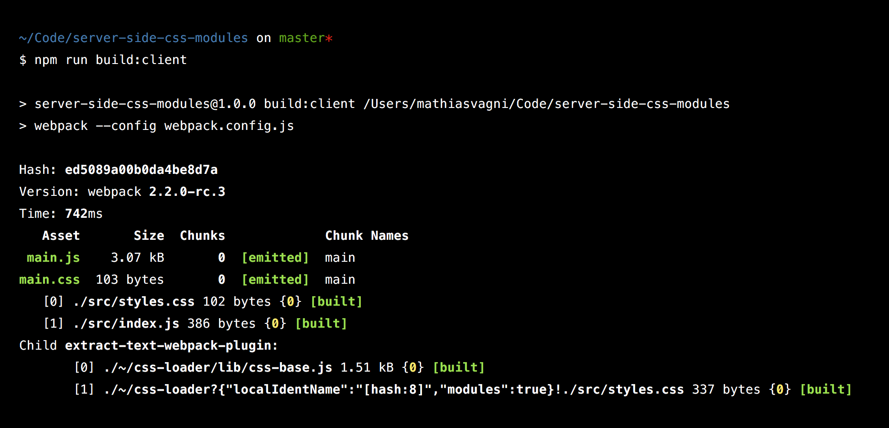
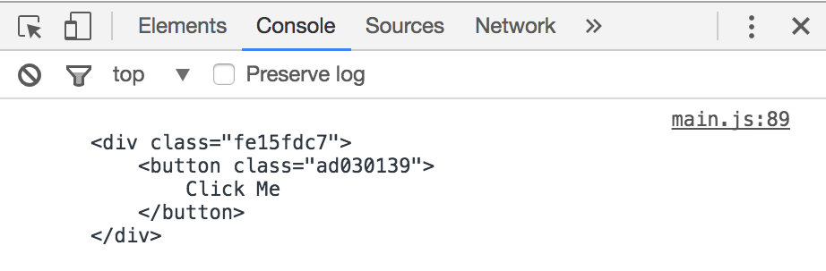
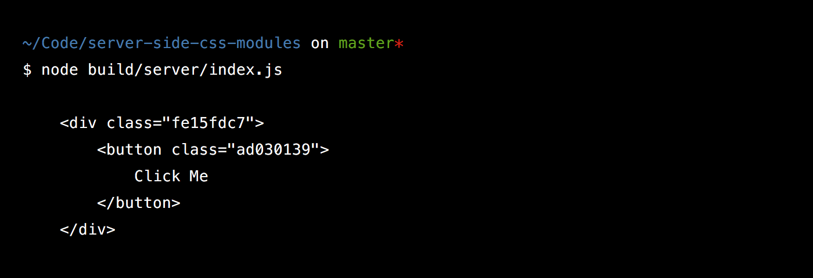

It’s currently still relatively hard to understand how to use CSS modules on the server & client based on existing docs. A large part of that I think is that there are generally a lot of moving parts and no definitive way to do anything. If you’ve never worked with CSS modules for real you probably have at least a few of these questions floating around regarding the actual technical set-up: Do you use some require hook on the server? Can’t you just Webpack your backend ? What does babel do with css modules? How do I use sass/post-css/both? How does it work when you are working on a project and want to watch for changes?

For the sake of this I won’t be using React or anything like that. It’s completely irrelevant to how CSS modules work & there are many great tutorials on how to use React on the server & client. I’ll instead use a super simple example file which literally just console.logs a bit of html with the right selectors. This, I think, makes it a lot easier to understand what’s going on since there are a lot fewer moving parts.

> 📢 I will be using Webpack 2 because it’s the future — also it’s just nicer to configure loaders (no more crazy query strings).

## What’s the goal?

We want, in the end, 3 files to be outputted:

1. A javascript file we can serve in the browser
2. A javascript file we can run as our back-end
3. A single css file.

For a nice developer experience we’ll want to use sass & post-css to prefix our css for us.

## Basic setup

To get us going there are 3 main files we’ll start with:

### index.js

This is our main file we’ll use to test everything is working.

```js
import styles from './styles.css';

console.log(
  `
    <div class="${styles.wrapper}">
        <button class="${styles.button}">
            Click Me
        </button>
    </div>
    `,
);
```

### styles.css

Our css. For now we’ll just use standard css and will then add support for sass & auto-prefixing later.

```css
.wrapper {
  display: flex;
}
.button {
  color: red;
}
.button:hover {
  color: green;
}
```

### index.html

This will be how we test the browser build. This is just so we know stuff works.

```html
<html>
    <head>
        <link rel="stylesheet" href="./build/client/main.css">
    </head>
    <body>
        <script src="./build/client/main.js"></script>
    </body>
</html>
```

## Install all the things

As a first step we need to install a the basic dependencies to make this work.

To do this we’ll need a couple of things:

* [webpack](https://webpack.js.org/) (we’ll install a special version since at the time of writing v. 2 has not yet been publicly released)
* [babel-loader](https://www.npmjs.com/package/babel-loader) (A webpack loader that uses babel to transform your code)
* babel-core (This is a peer dependencies of babel-loader — the babel in babel-loader.)
* babel-preset-es2015 (The preset which we want babel to use to compile our code)

To install these:

```sh
npm install --save babel-loader webpack@2.2.0-rc.3 extract-text-webpack-plugin@2.0.0-beta.4 css-loader babel-core babel-preset-es2015
```

## The Webpack config

We now need to configure Webpack to do the ‘right thing’. We mainly care about the loaders but here is the Webpack config in it’s entirety.

I’m assuming you already have some basic experience with Webpack so I won’t go into what entry, output and resolve options do. They are explained very well in the [Webpack docs themselves](https://webpack.js.org/configuration/).

In a new file called webpack.config.js in the root:

```js
const ExtractTextPlugin = require('extract-text-webpack-plugin');

module.exports = {
  entry: {
    main: './src/index.js',
  },

  output: {
    path: './build/client/',
    filename: '[name].js',
  },

  resolve: {
    extensions: ['.js', '.css'],
  },

  module: {
    rules: [
      {
        test: /\.js$/,
        exclude: /node_modules/,
        use: 'babel-loader',
      },
      {
        test: /\.css$/,
        loader: ExtractTextPlugin.extract({
          loader: [
            {
              loader: 'css-loader',
              query: {
                localIdentName: '[hash:8]',
                modules: true,
              },
            },
          ],
        }),
      },
    ],
  },

  plugins: [
    new ExtractTextPlugin({
      filename: '[name].css',
      allChunks: true,
    }),
  ],
};
```

We need to do two things, build javascript files using babel & handle the importing of css. Because of this we have two rules in `modules`: one which matches any files with `.js` extension and another which follows the `.css` extension.

### The babel-loader

This is this bit of the config:

```js
{
  test: /\.js$/,
  exclude: /node_modules/,
  use: 'babel-loader'
}
```

This will just babelify your javascript code. It will, by default, look for a .babelrc file in the root of your project (or wherever you call Webpack from). Because of this we have to add a .babelrc file to the root of our project which looks like so:

```js
{
    "presets": [
        ["es2015"]
    ]
}
```

### The css-loader (and the extract text magic)

The config for the css-loader looks like this:

```js
{
  test: /\.css$/,
  loader: ExtractTextPlugin.extract({
    loader: [
      {
        loader: 'css-loader',
        query: {
          localIdentName: '[hash:8]',
          modules: true
        }
      }
    ]
  })
}
```

By default what the css-loader does when css modules are turned on (that’s what `modules: true` does) is extract the css & and the selectors and make them available to you in javascript in the form of a string and a mapping of selectors.

> 📢 Side-note: The whole point of css modules is to ‘scope’ css. In order to do this the css-loader modifies your selectors in order to prevent selectors from clashing. This is so two separate css files could have the same selector without them overriding each-other. You can control how your selectors are modified by using the `localIdentName` option. `[hash:8]` outputs the first 8 characters of a hash of the path to the css file + the selector.

So anyways… by default the css-loader would output this (all comments from Webpack itself):

```js
/***/ function(module, exports, __webpack_require__) {

 exports = module.exports = __webpack_require__(1)();
// imports

 // module
exports.push([module.i, ".fe15fdc7 {\n    display: flex;\n}\n\n.ad030139 {\n    color: red;\n}\n\n.ad030139:hover {\n    color: green;\n}\n", ""]);

 // exports
exports.locals = {
 "wrapper": "fe15fdc7",
 "button": "ad030139"
};

/***/ },
```

This would be kind of correct. It’s correctly creates a mapping between our css selectors in styles.css & used the `localIdentName` we specified to created a hashed version of those selectors. However as you can see it’s also inlined our actual CSS. This isn’t ideal; as we said at the beginning our goal is to extract all of our css into a single file that we can then serve on it’s own. That is what the `extract-text-webpack-plugin` does. When the extract text plugin wraps the css-loader (like in our Webpack config above) the output instead becomes:

```js
/***/ function(module, exports) {

// removed by extract-text-webpack-plugin
module.exports = {"wrapper":"fe15fdc7","button":"ad030139"};

/***/ },
```

Our css is no longer inlined but we’ve kept our css selector mapping. 🙌

Ok but.. where did our css go? If you have another look at our complete Webpack config above you’ll notice that there are two parts to the extract-text-webpack-plugin. The first bit wraps some loader(s). The second bit is a plugin that then outputs all extracted text, this bit:

```js
plugins: [
  new ExtractTextPlugin({
    filename: '[name].css',
    allChunks: true,
  }),
];
```

This will basically, collect all extracted css & output it every build. Because we want all css to be outputted into a single file we set `allChunks` to true. Otherwise you get a css file outputted per chunk. The `[name].css` filename means it will output a css file in the same name as the entry point.

If we now add a script to our package.json like so:

```js
"scripts": {
   "build:client": "webpack --config webpack.config.js"
},
```

… and run our script we get:

<figure class="medium">
  
  <figcaption>
    This is a caption.
  </figcaption>
</figure>

So we are getting one javascript bundle & one css file 💪

If we look at the actual output we now see that our css has been transformed using the `localIdentName` pattern we specified.

```css
.fe15fdc7 {
  display: flex;
}
.ad030139 {
  color: red;
}
.ad030139:hover {
  color: green;
}
```

And that these selectors match our javascript’s mapping in the built bundle.

If we now run open up our simple index.html file to test this, we get this:

<figure>
  
</figure>

So now that our browser build is done let’s move on to…

## How does it work on the server?

What you want on the server is ideally the selectors inlined without all the bundling stuff that Webpack does.

I’ve gone down the route of trying to use Webpack to build server-side code but found a number of things (this is just a selection) to be annoying:

* It was surprisingly slow, even with a little project (since you need to generate source maps & then use [something like this](https://github.com/evanw/node-source-map-support).

* Behave really weird with node globals such as `__dirname` and `__filename` (you have to tell Webpack to ignore them or it will set them to undefined)

* You have to do some extra magic to tell Webpack to not bundle all your node_modules (since they are not always just javascript / bundle-able)

### Enter Babel

The best/nicest way I’ve found to get this to work is by using **just** babel to build our back-end. You’d likely have to do this anyways if you are using something like React + it’s really nice having back-end code that is easily readable and not bundled when debugging stuff.

So what we need is a babel-plugin that basically does what the css-loader does in our Webpack build. We don’t however care about actually outputting a css file – all we care about is the mapping of selectors.

Jackpot: [https://www.npmjs.com/package/babel-plugin-css-modules-transform](https://www.npmjs.com/package/babel-plugin-css-modules-transform)

We’ll want to add a script to our package.json and use babel from the command line. That means we’ll also need to install the babel-cli besides the plugin.

```sh
npm install --save babel-plugin-css-modules-transform babel-cli
```

Use the plugin like so in your .babelrc file we created earlier:

```js
{
    "presets": [
        ["es2015"]
    ],
    "env": {
        "server": {
            "plugins": [
                [
                    "css-modules-transform", {
                        "generateScopedName": "[hash:8]",
                        "extensions": [".css"]
                    }
                ]
            ]
        }
    }
}
```

The env keys in .babelrc files let you change your config when there is a specific `BABEL_ENV` or `NODE_ENV` set (it checks them in that order). This is super useful in this case because we only want this plugin to run when we are building our backend — not when Webpack is bundling the client bundle (remember: the Webpack babel-loader also uses this .babelrc file)

The `generatedScopedName` is the same as the css-loader’s `localIdentname` in our Webpack config. _#naming_

The extension of `.css` just tells babel to follow these imports. Otherwise it will ignore imports of files it doesn’t understand.

To test this, let’s add an npm script to create our back-end build:

```js
"scripts": {
    "build:client": "webpack --config webpack.config.js",
    "build:server": "BABEL_ENV=server babel src --out-dir ./build/server"
}
```

Notice how I’m setting the `BABEL_ENV` environment key so that we use the babel plugin above on our server build.

When we run `npm run build:server` we now get:

```js
'use strict';

var _styles = {
  wrapper: 'fe15fdc7',
  button: 'ad030139',
};

var _styles2 = _interopRequireDefault(_styles);

function _interopRequireDefault(obj) {
  return obj && obj.__esModule ? obj : { default: obj };
}

console.log(
  '\n    <div class="' +
    _styles2.default.wrapper +
    '">\n        <button class="' +
    _styles2.default.button +
    '">\n            Click Me\n        </button>\n    </div>\n    ',
);
```

And if we run it from the command line ( `node build/server/index.js` ):

<figure>
  
</figure>

---

## omg omg omg it works.

Ok, we now have front-end and back-end builds working…

<figure>
  
</figure>

But… there are still a few things missing:

* How do we use sass?
* How do we use autoprefixer?
* How do we watch for changes & rebuild as needed?

---

## Using Sass

First thing, let’s rename our .css file to be .scss and convert it to actually use sass style nesting so that we can check whether our sass setup work:

```sass
.wrapper {
    display: flex;
}

.button {
    color: red;

    &:hover {
        color: green;
    }
}
```

Just to check that our sass build works I’ve changed the &:hover selector to be nested.

Then, let’s change our import to actually to use the new .scss extension:

```js
import styles from './styles.scss';

console.log(
  `
    <div class="${styles.wrapper}">
        <button class="${styles.button}">
            Click Me
        </button>
    </div>
    `,
);
```

Then, let’s install the normal Webpack sass-loader:

```sh
npm install --save sass-loader node-sass
```

We’ll need to now change our Webpack build to use the sass-loader before giving everything to the css-loader like before:

```js
{
    test: /\.scss$/,
    loader: ExtractTextPlugin.extract({
        loader: [
            {
                loader: 'css-loader',
                query: {
                    localIdentName: '[hash:8]',
                    modules: true
                }
            },
            {
                loader: 'sass-loader'
            }
        ]
    })
}
```

⚠️ Don’t forget to change the ‘test’ to match your new extension of `.scss`

The loaders, you’ll notice, are consumed from right to left. That means our .scss file will first be converted to css so that the css-loader then understands it.

If we run our client build we’ll now see everything work as before & output the same css we had earlier:

```css
._6de768fc {
  display: flex;
}

._8e1229bd {
  color: red;
}
._8e1229bd :hover {
  color: green;
}
```

This however only works for the Webpack build. In order for this to work for our server build we are going to have to tell the babel css modules plugin to also preprocess css using sass.

To do this we have an option called `preprocessCss` we can use which takes the path to a file that pre-process our css.

So let’s modify our .babelrc file to add the preprocessing option:

```js
{
    "presets": [
        ["es2015"]
    ],
    "env": {
        "server": {
            "plugins": [
                [
                    "css-modules-transform", {
                        "preprocessCss": "./loaders/sass-loader.js",
                        "generateScopedName": "[hash:8]",
                        "extensions": [".scss"]
                    }
                ]
            ]
        }
    }
}
```

⚠️ Like in the Webpack config, don’t forget to change the extension to .scss!

Notice how we are pointing to a file in loaders/sass-loader.js that doesn’t yet exist so let’s write that — thankfully it’s quite simple:

```js
const sass = require('node-sass');

module.exports = (data, file) => {
  try {
    return sass.renderSync({ data, file }).css.toString('utf8');
  } catch (e) {
    console.error(e);
  }
};
```

It’s important you use the try catch or you will miss errors (took me a while to work this out 😅). All this does is call node-sass (which we installed earlier as a peer-dependency of sass-loader) on our css file.

Now if we run a server build it all works like before but with the added magic of sass:

```js
'use strict';

var _styles = {
  wrapper: '_6de768fc',
  button: '_8e1229bd',
};

var _styles2 = _interopRequireDefault(_styles);

function _interopRequireDefault(obj) {
  return obj && obj.__esModule ? obj : { default: obj };
}

console.log(
  '\n    <div class="' +
    _styles2.default.wrapper +
    '">\n        <button class="' +
    _styles2.default.button +
    '">\n            Click Me\n        </button>\n    </div>\n    ',
);
```

---

## Adding PostCSS / Autoprefixer

The last thing we need to do is run autoprefixer over our css to prefix things like flexbox which still don’t have consistent browser support.

Because autoprefixer only changes the actual css rule declarations and not the selectors we actually don’t need to do anything special for our server-build. We only have to get it to work on the client Webpack build.

This one is easy: install autoprefixer & the postcss-loader (both super standard, you’ll probably have used these before):

```js
npm install --save autoprefixer postcss-loader
```

Then add the postcss-loader to our Webpack config after sass but before the css-loader (line 12–14):

```js
{
    test: /\.scss$/,
    loader: ExtractTextPlugin.extract({
        loader: [
            {
                loader: 'css-loader',
                query: {
                    localIdentName: '[hash:8]',
                    modules: true
                }
            },
            {
                loader: 'postcss-loader'
            },
            {
                loader: 'sass-loader'
            }
        ]
    })
}
```

The postcss-loader will look for another config file called postcss.config.js in the root of your project (much like the babel-loader looks for .babelrc file).

So let’s create a postcss.config.js file in our root:

```js
const autoprefixer = require('autoprefixer');

module.exports = {
  plugins: [
    autoprefixer({
      browsers: ['last 2 versions', 'IE >= 9', 'safari >= 8'],
    }),
  ],
};
```

Much like if you were using autoprefixer else-where, you can specify what browser versions you want to support etc.

Now, if we run `npm run build:client` again we’ll see that our css is correctly being prefixed (notice the flex-box stuff):

```css
._6de768fc {
  display: -webkit-flex;
  display: -ms-flexbox;
  display: flex;
}

._8e1229bd {
  color: red;
}
._8e1229bd :hover {
  color: green;
}
```

## Watching for changes

I saved this for last because it not only made logical sense but also… because it’s pleasingly simple.

Just call Webpack & babel with `--watch` respectively 😊

Simply add these two scripts to your package.json and run them in separate tabs:

```js
"scripts": {
  "build:client": "webpack --config webpack.config.js",
  "build:server": "BABEL_ENV=server babel src --out-dir ./build/server",
  "watch:client": "npm run build:client -- --watch",
  "watch:server": "npm run build:server -- --watch"
}
```

📢 Only one super small gotcha: The `babel-plugin-css-modules-transform` has some caching when you don’t set your `NODE_ENV` to "development" . If you are using react or something you will get mismatch errors when running watch and changing a lot of files — unless you set the `NODE_ENV`. You can, if you want to keep this simple just set your node env in the actual npm script like `BABEL_ENV` above.

---

## Wow. You read all of this.

You can find [the complete example code here](https://github.com/mattvagni/server-side-css-modules).

Any feedback? Did I get something wrong? Is there a way way nicer way of doing all this?

Find me on on twitter as [@mattvagni](https://www.twitter.com/mattvagni)
